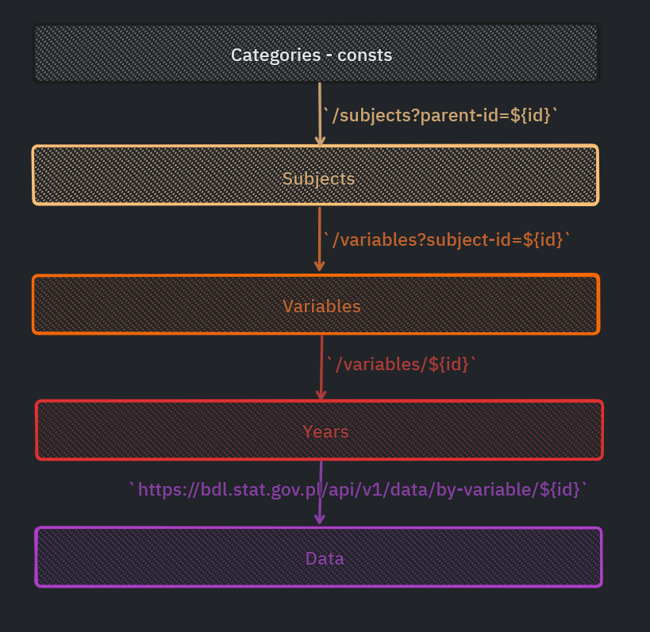

# :chart: European Election Charts

### https://ascislowska.github.io/europeanElections/

## Typescript + Recharts + Bulma

A web application that creates rankings of voivodeships on the basis of the Local Data Bank. The application is built in React using Redux, React-Redux, Redux Thunk and the Axios library. To style the application, I used the Semantic UI library.

## Application operation:

1. The user selects the category and subject of the ranking. The selected category is saved in the Redux Store and the action creator is launched. Thanks to Redux Thunk and Axios library, action creator downloads the list of topics for the given category from the GUS API. For a better UX, after entering the page, the first category from the list is selected by default (using useEffect).
2. The user goes to a route with variables available for a given topic in terms of time.
   Based on the id in the url, the application downloads a list of variables available for a given topic, and then selects the first variable from the list as active by default.
3. After selecting the active variable, the application sends a request to the gus API for a list of years available for this variable and displays it on the page. By default, it selects the first year in the list.
4. When we have the variable and year specified, the fetchData function is launched, which fetches a set of data from the GUS api.
5. The ShowData component checks if an object with data to be displayed is available in the Redux Store. When it appears, the ShowData function maps the list of data.
   The data is available in the form of a list - each voivoidship represents an object. Inside the object there is another list with the right data - to gain access to them I use a nested map loop.
6. Category selection is saved in Redux and is stored until another theme is selected. The rest of the data is cleaned up from the Redux store each time the (using the cleanup function in useEffect Hook) - this way there is no risk that the data downloaded earlier will be displayed on another topic.

## Technologies used

- Redux
  - [Actions](https://github.com/ascislowska/statistics/src/actions/index.js "actions")
  - [Reducer](https://github.com/ascislowska/statistics/src/reducers/index.js "reducer")
  - [MapStateToProps](https://github.com/ascislowska/statistics/blob/b285ac671e2020ee4c97d99dd4fac389c9d5ee99/src/components/ShowVariables.js#L123)
- React Router Dom
  - [Routes](https://github.com/ascislowska/statistics/src/components/App.js "routes")
- React reusable components:
  - [ShowData](https://github.com/ascislowska/statistics/src/components/ShowData.js "rendering data")
- Styled with Semantic UI
- Deployed with Firebase

## Available Scripts

This project was bootstrapped with [Create React App](https://github.com/facebook/create-react-app).

In the project directory, you can run:

### `npm start`

Runs the app in the development mode.\
Open [http://localhost:3000](http://localhost:3000) to view it in the browser.
